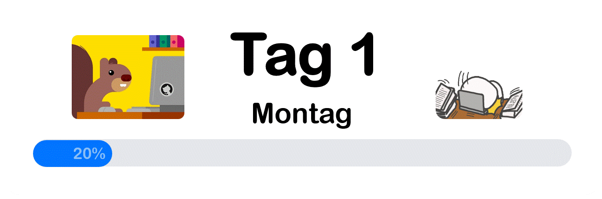
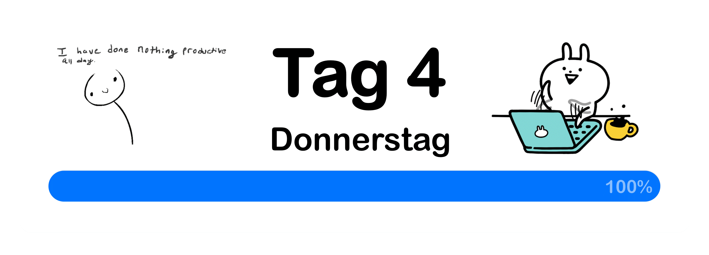

# Setup Guide

<!-- Structure -->
### Structure
1. [Software herunterladen 💾](#software-herunterladen-)
    1. [Download Minecraft](#download-minecraft-) 

    2. [Download Java](#download-java-) 

    3. [Download IntelliJ](#download-intellij-) 

    4. [Download Paper](#download-paper-) 

2. [Paper Server einrichten](#paper-server-einrichten-) 

3. [IntelliJ einrichten](#intellij-einrichten-) 

4. [Erstellen eines ersten Plugins 🛠️](#erstellen-eines-ersten-plugins-%EF%B8%8F)

5. [Zusatz ➕](#zusatz-)
    1. [Output Ordner der Build Datei festlegen 📂](#output-ordner-der-build-datei-festlegen-)

<br>
<br>

# Software herunterladen 💾

<!-- ↓ Download Minecraft ↓ -->

## Download Minecraft 

Minecraft ist das Computerspiel für welches wir Plugins erstellen wollen.

### Website
&nbsp;&nbsp;&nbsp;&nbsp;[Minecraft Download Page](https://www.minecraft.net/de-de/download)

<!-- Back to top Button -->
<p align="center"><a href="#setup-guide"><kbd>🔼 Back to top</kbd></a></p>

<!-- ↑ Download Minecraft ↑ -->


<!-- ↓ Download Java ↓ -->

## Download Java 

Java ist die absolute Basis, in dieser Objektorientierten Programmiersprache schreiben wir unsere Plugins.

### Benötigte Java-Version
- Version: `JDK 21`
- Betriebssystem: `Windows`

### Website
&nbsp;&nbsp;&nbsp;&nbsp;[Java JDK 21 Download Page](https://www.oracle.com/java/technologies/downloads/#jdk21-windows)

<!-- Doppel Leerzeichen macht neue Zeile -->
> **Note:**  
> Java JDK 21 wird benötigt um Plugins für die neueste Minecraft Version zu
> erstellen. Sie enthält direkt das entsprechende JRE, weshalb man das
> Runtime Environment nicht extra herunterladen muss.

<!-- Back to top Button -->
<p align="center"><a href="#setup-guide"><kbd>🔼 Back to top</kbd></a></p>

<!-- ↑ Download Java ↑ -->


<!-- ↓ Download IntelliJ ↓ -->

## Download IntelliJ 

IntelliJ ist die IDE mit der wir unsere Plugins in der Programmiersprache Java erstellen wollen.

### Website
&nbsp;&nbsp;&nbsp;&nbsp;[IntelliJ Download Page](https://www.jetbrains.com/idea/download/?section=windows)

> ⚠️ **Wichtig:**  
> Auf der Seite herunterscrollen und Community Edition herunterladen.

<!-- Back to top Button -->
<p align="center"><a href="#setup-guide"><kbd>🔼 Back to top</kbd></a></p>

<!-- ↑ Download IntelliJ ↑ -->


<!-- ↓ Download Paper ↓ -->

## Download Paper 

### Vorher
&nbsp;&nbsp;&nbsp;&nbsp;Ordner erstellen in dem die heruntergeladene Server Datei abgelegt werden kann.  
&nbsp;&nbsp;&nbsp;&nbsp;Zum Beispiel:  
&nbsp;&nbsp;&nbsp;&nbsp;`C:\Users\Max\1.21.8 - Server`

### Benötigte Paper-Version
- Version: `1.21.8`
- Build: `Newest Build`

### Website
&nbsp;&nbsp;&nbsp;&nbsp;[Paper Download Page](https://papermc.io/downloads/paper)

<!-- Back to top Button -->
<p align="center"><a href="#setup-guide"><kbd>🔼 Back to top</kbd></a></p>

<!-- ↑ Download Paper ↑ -->

<br>
<br>

<!-- ↓ Paper Server einrichten ↓ -->

# Paper Server einrichten 

### Prüfen ob Java installiert ist
  - Command (in CMD ausführen):  
    `java -version`  
    Wenn es keinen Fehler gibt ist Java installiert.

### Server Start Datei erstellen
  1. Erstelle eine `start.bat` Datei im Server Verzeichnis  
  2. Inhalt der `start.bat`:  
     ```bat
     java -jar paper-1.21.8-60.jar --nogui
     ```
     Der Name der Datei kann variieren: `paper-<version>.jar`.

### Starten des Server
  1. `start.bat` Datei doppelt anklicken
  2. Beim ersten Start des Servers tritt ein Fehler auf
     ```
     You need to agree to the EULA in order to run the server. Go to eula.txt for more info.
     ```
  3. CMD-Fenster schließen
  4. `eula.txt` Datei im Server Verzeichnis öffnen
  5. `eula=false` auf `eula=true` setzen
  6. Erneut die `start.bat` Datei doppelt anklicken
  
> **Note:**  
> Der Server staret nun ohne GUI. Um den Server mit GUI zu starten, muss lediglich in der `start.bat` Datei der zusatz `--nogui` vom Startbefehl entfernt werden.

<!-- Back to top Button -->
<p align="center"><a href="#setup-guide"><kbd>🔼 Back to top</kbd></a></p>

<!-- ↑ Paper Server einrichten ↑ -->

<br>
<br>

<!-- ↓ IntelliJ einrichten ↓ -->

# IntelliJ einrichten 

### IntelliJ fertig installieren
  1. Falls noch nicht geschehen, IntelliJ installer doppelt anklicken
  2. Installer durchlaufen

### Installieren des Minecraft Developer Plugins
  1. Wenn man IntelliJ öffnet, sollte man ein Fenster sehen in dem man ein neues Projekt erstellen kann
  2. In diesem Fenster **links** auf den Plugins Button drücken
  3. Im Plugin Menü nach dem Plugin `Minecraft Development` suchen
  4. Auf installieren klicken
  5. IDE neustarten wenn man dazu aufgefordert wird

<!-- Back to top Button -->
<p align="center"><a href="#setup-guide"><kbd>🔼 Back to top</kbd></a></p>

<!-- ↑ IntelliJ einrichten ↑ -->

<br>
<br>

<!-- ↓ Erstellen eines ersten Plugins ↓ -->

# Erstellen eines ersten Plugins 🛠️

### Neues Projekt erstellen
1. Im kleinen IntelliJ Fenster auf `Neues Projekt` klicken
2. Auf der **linken** Seite auf Minecraft klicken um ein Minecraft Projekt zu   erstellen
3. Daten des neuen Projekts angeben
    1. Name des neuen Projekts angeben, z.B. `MyFirstPlugin`
    2. Location angeben. Kann frei gewählt werden. **Nicht** der Server Ordner.
    3. Als Group `Plugin` auswählen
    4. Als Template `Paper` auswählen
    5. Als Build System `Gradle` auswählen
    6. Als Language `Java` auswählen
    7. Als Minecraft Version die Version des installierten Paper Servers (in diesem Fall `1.21.8`) auswählen
    8. Main Class zu **[domain]**.**[package]**.**`Main`** ändern
    9. Create klicken und abwarten

> **Note:**  
> Domain kann z.B. `com.max` sein. Das Package ist im normalfall der Name des Projekts.

<!-- Back to top Button -->
<p align="center"><a href="#setup-guide"><kbd>🔼 Back to top</kbd></a></p>

<!-- ↑ Erstellen eines ersten Plugins -->


<!-- ↓ Zusatz ↓ -->

# Zusatz ➕

### Output Ordner der Build Datei festlegen 📂
1. `build.gradle` Datei öffnen
2. Diesen Code ans Ende der Datei anhängen:
    ```
    tasks.jar {
        destinationDirectory = file("Path/To/Server")
    }
    ```
3. `Path/To/Server` mit dem Pfad zum Server Plugins Ordner austauschen.  
   Zum Beipspiel:  
   `C:\Users\Max\1.21.8 - Server\plugins`

<!-- Back to top Button -->
<p align="center"><a href="#setup-guide"><kbd>🔼 Back to top</kbd></a></p>

<!-- ↑ Zusatz -->
