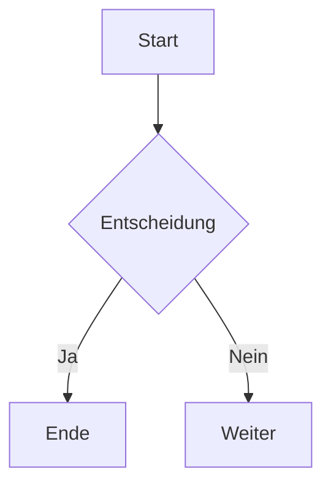

# Hallo

*kursiv* oder _kursiv_
**fett** oder __fett__
***fett + kursiv***
~~durchgestrichen~~
`Inline-Code`

> **Hinweis:** Das ist ein Callout / Hinweis-Block.

- Item A
- Item B
  - Unterpunkt B1
  - Unterpunkt B2

1. Erster
2. Zweiter
   1. Unterpunkt

- [x] Erledigt 
- [ ] Offen

> Dies ist ein Zitat.
> Mehrere Zeilen möglich.

```python
def hallo():
    print("Hallo Welt")
```

# Tabellen
| Name    | Alter | Stadt      |
|--------:|:-----:|:-----------|
| Anna    |  28   | Berlin     |
| Bernd   |  34   | München    |

### Einfaches Bild
")

### Bild mit Link
[](https://example.com)

## Links
[Linktext](https://example.com)
Autolink: <https://example.com>
Referenzstil:
[google]: https://google.com "Google"
[Suche][google]

## Buttons laut ChatGPT
[Klicke hier](https://example.com)

## Fußnote
[^1]: Fußnoten-Text hier.


## Diagramme


## Definitionen
Begriff
:   Definition des Begriffs.

Anderer Begriff
:   Weitere Erklärung.

## Emojis
:smile: :thumbsup:
