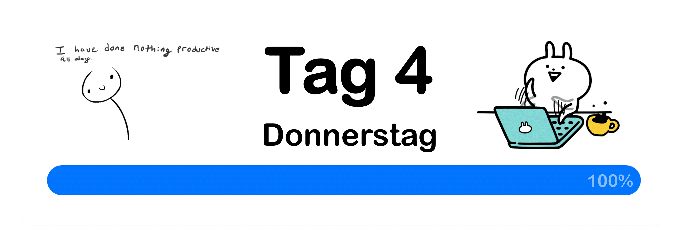
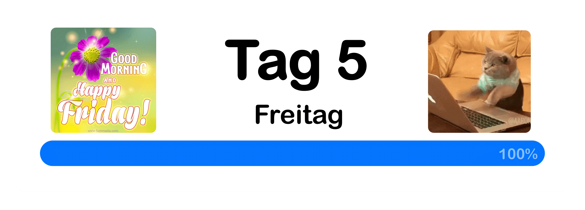

<!--  -->
<!--  -->
<!--  -->

# Setup Guide

<!-- Structure -->
### Structure
1. [Software herunterladen 💾](#software-herunterladen-)
    1. [Download Minecraft](#download-minecraft-) 

    2. [Download Java](#download-java-) 

    3. [Download IntelliJ](#download-intellij-) 

    4. [Download Paper](#download-paper-) 

2. [Minecraft einrichten](#minecraft-einrichten-) 

3. [Paper Server einrichten](#paper-server-einrichten-) 

4. [IntelliJ einrichten](#intellij-einrichten-) 

5. [Erstellen eines ersten Plugins 🛠️](#erstellen-eines-ersten-plugins)

6. [Zusatz ➕](#zusatz-)
    1. [Output Ordner der Build Datei festlegen 📂](#output-ordner-der-build-datei-festlegen-)
    2. [Looping startup Script 🔁](#looping-startup-script-)
    3. [Debugging Plugins (Hotswap) 🔥](#debugging-plugins-hotswap-)

7. [Projects 🚀](#projects-)
    1. [Sample 🧪](#sample-)

8. [Contributors ✨](#contributors-)

<br>
<br>

# Software herunterladen 💾

<!-- ↓ Download Minecraft ↓ -->

## Download Minecraft 

Minecraft ist das Computerspiel für welches wir Plugins erstellen wollen.

### Website
&nbsp;&nbsp;&nbsp;&nbsp;[Minecraft Download Page](https://www.minecraft.net/de-de/download)

> ⚠️ **Wichtig:**  
> Minecraft Installer nicht ausführen

<!-- Back to top Button -->
<p align="center"><a href="#setup-guide"><kbd>🔼 Back to top</kbd></a></p>

<!-- ↑ Download Minecraft ↑ -->


<!-- ↓ Download Java ↓ -->

## Download Java 

Java ist die absolute Basis, in dieser Objektorientierten Programmiersprache schreiben wir unsere Plugins.

### Benötigte Java-Version
- Version: `JDK 21`
- Betriebssystem: `Windows`

### Website
&nbsp;&nbsp;&nbsp;&nbsp;[Java JDK 21 Download Page](https://www.oracle.com/java/technologies/downloads/#jdk21-windows)

<!-- Doppel Leerzeichen macht neue Zeile -->
> **Note:**  
> Java JDK 21 wird benötigt um Plugins für die neueste Minecraft Version zu
> erstellen. Sie enthält direkt das entsprechende JRE, weshalb man das
> Runtime Environment nicht extra herunterladen muss.

<!-- Back to top Button -->
<p align="center"><a href="#setup-guide"><kbd>🔼 Back to top</kbd></a></p>

<!-- ↑ Download Java ↑ -->


<!-- ↓ Download IntelliJ ↓ -->

## Download IntelliJ 

IntelliJ ist die IDE mit der wir unsere Plugins in der Programmiersprache Java erstellen wollen.

### Website
&nbsp;&nbsp;&nbsp;&nbsp;[IntelliJ Download Page](https://www.jetbrains.com/idea/download/?section=windows)

> ⚠️ **Wichtig:**  
> Auf der Seite herunterscrollen und Community Edition herunterladen.

<!-- Back to top Button -->
<p align="center"><a href="#setup-guide"><kbd>🔼 Back to top</kbd></a></p>

<!-- ↑ Download IntelliJ ↑ -->


<!-- ↓ Download Paper ↓ -->

## Download Paper 

### Vorher
&nbsp;&nbsp;&nbsp;&nbsp;Ordner erstellen in dem die heruntergeladene Server Datei abgelegt werden kann.  
&nbsp;&nbsp;&nbsp;&nbsp;Zum Beispiel:  
&nbsp;&nbsp;&nbsp;&nbsp;`C:\Users\Max\1.21.8 - Server`

### Benötigte Paper-Version
- Version: `1.21.8`
- Build: `Newest Build`

### Website
&nbsp;&nbsp;&nbsp;&nbsp;[Paper Download Page](https://papermc.io/downloads/paper)

<!-- Back to top Button -->
<p align="center"><a href="#setup-guide"><kbd>🔼 Back to top</kbd></a></p>

<!-- ↑ Download Paper ↑ -->

<br>
<br>

<!-- ↓ Minecraft einrichten ↓ -->

# Minecraft einrichten 

### Bei XBox anmelden
1. XBox app öffnen
2. Mit Microsoft Account anmelden

### Minecraft Installer öffnen
1. Minecraft Installer im Download Ordner doppelt anklicken
2. Installer durchlaufen
3. Durch das anmelden bei XBox ist der Microsoft Account bereits bei Minecraft festgelegt

<!-- Back to top Button -->
<p align="center"><a href="#setup-guide"><kbd>🔼 Back to top</kbd></a></p>

<!-- ↑ Minecraft einrichten ↑ -->

<!-- ↓ Paper Server einrichten ↓ -->

# Paper Server einrichten 

### Prüfen ob Java installiert ist
  - Command (in CMD ausführen):  
    `java -version`  
    Wenn es keinen Fehler gibt ist Java installiert.

### Server Start Datei erstellen
  1. Erstelle eine `start.bat` Datei im Server Verzeichnis  
  2. Inhalt der `start.bat`:  
     ```bat
     java -jar paper-1.21.8-60.jar --nogui
     ```
     Der Name der Datei kann variieren: `paper-<version>.jar`.

### Starten des Server
  1. `start.bat` Datei doppelt anklicken
  2. Beim ersten Start des Servers tritt ein Fehler auf
     ```
     You need to agree to the EULA in order to run the server. Go to eula.txt for more info.
     ```
  3. CMD-Fenster schließen
  4. `eula.txt` Datei im Server Verzeichnis öffnen
  5. `eula=false` auf `eula=true` setzen
  6. Erneut die `start.bat` Datei doppelt anklicken
  
> **Note:**  
> Der Server staret nun ohne GUI. Um den Server mit GUI zu starten, muss lediglich in der `start.bat` Datei der zusatz `--nogui` vom Startbefehl entfernt werden.

<!-- Back to top Button -->
<p align="center"><a href="#setup-guide"><kbd>🔼 Back to top</kbd></a></p>

<!-- ↑ Paper Server einrichten ↑ -->

<br>
<br>

<!-- ↓ IntelliJ einrichten ↓ -->

# IntelliJ einrichten 

### IntelliJ fertig installieren
  1. Falls noch nicht geschehen, IntelliJ installer doppelt anklicken
  2. Installer durchlaufen

### Installieren des Minecraft Developer Plugins
  1. Wenn man IntelliJ öffnet, sollte man ein Fenster sehen in dem man ein neues Projekt erstellen kann
  2. In diesem Fenster **links** auf den Plugins Button drücken
  3. Im Plugin Menü nach dem Plugin `Minecraft Development` suchen
  4. Auf installieren klicken
  5. IDE neustarten wenn man dazu aufgefordert wird

<!-- Back to top Button -->
<p align="center"><a href="#setup-guide"><kbd>🔼 Back to top</kbd></a></p>

<!-- ↑ IntelliJ einrichten ↑ -->

<br>
<br>

<!-- ↓ Erstellen eines ersten Plugins ↓ -->

<!-- H1 tag da sonst der Anker Link nicht funktioniert -->
<h1 id="erstellen-eines-ersten-plugins">Erstellen eines ersten Plugins 🛠️</h1>

### Neues Projekt erstellen
1. Im kleinen IntelliJ Fenster auf `Neues Projekt` klicken
2. Auf der **linken** Seite auf Minecraft klicken um ein Minecraft Projekt zu   erstellen
3. Daten des neuen Projekts angeben
    1. Name des neuen Projekts angeben, z.B. `MyFirstPlugin`
    2. Location angeben. Kann frei gewählt werden. **Nicht** der Server Ordner.
    3. Als Group `Plugin` auswählen
    4. Als Template `Paper` auswählen
    5. Als Build System `Gradle` auswählen
    6. Als Language `Java` auswählen
    7. Als Minecraft Version die Version des installierten Paper Servers (in diesem Fall `1.21.8`) auswählen
    8. Main Class zu **[domain]**.**[package]**.**`Main`** ändern
    9. Create klicken und abwarten

> **Note:**  
> Domain kann z.B. `com.max` sein. Das Package ist im normalfall der Name des Projekts.

<!-- Back to top Button -->
<p align="center"><a href="#setup-guide"><kbd>🔼 Back to top</kbd></a></p>

<!-- ↑ Erstellen eines ersten Plugins -->


<!-- ↓ Zusatz ↓ -->

# Zusatz ➕

### Output Ordner der Build Datei festlegen 📂
1. `build.gradle` Datei öffnen
2. Diesen Code ans Ende der Datei anhängen:
    ```
    tasks.jar {
        destinationDirectory = file("Path/To/Server")
    }
    ```
3. `Path/To/Server` mit dem Pfad zum Server Plugins Ordner austauschen.  
   Zum Beipspiel:  
   `C:\Users\Max\1.21.8 - Server\plugins`

<!-- Back to top Button -->
<p align="center"><a href="#setup-guide"><kbd>🔼 Back to top</kbd></a></p>


### Looping startup Script 🔁
Nach Änderungen die man an einem Plugin gemacht hat, ist es nötig den Server neu zu starten. Ohne Looping Script, würde sich die Konsole des aktuell laufenden Servers einfach schließen.

```batch
@echo off
:: Setting the title of the cmd
title Minecraft Server

:loop
:: Server start command
java -jar paper-<version>.jar nogui

echo Server crashed or restarted... Trying to start again in one second
:: Wait one second
timeout /t 1

:: Go back to loop start
goto loop
```

<!-- Back to top Button -->
<p align="center"><a href="#setup-guide"><kbd>🔼 Back to top</kbd></a></p>


### Debugging Plugins (Hotswap) 🔥
Minecraft Plugins zu Debuggen ist eine große erleichterung, denn so ist es möglich, Fehler die nicht beim kompilieren entdeckt wurden leichter zu erkennen. Für das Debuggen bietet Paper zwei Möglichkeiten, zum einen Logger Ausgaben in der Konsole oder das Nutzen eines Remote Debugger. Dieser pausiert den Code an einer definierten Stelle und man kann sich Variablen live ansehen.

- **Konsole**  
  1. Beispiel:  
     ```java
     plugin.getComponentLogger().debug(Component.text("SuperDuperBad Thing has happened"));
     ```

- **Remote Debugger**  
  1. Zunächst muss der Startup Command des Servers modifiziert werden
     ```batch
     java -agentlib:jdwp=transport=dt_socket,server=y,suspend=n,address=*:5005 -jar paper-1.21.8-60.jar nogui
     ```

  2. Jetzt muss eine neue Start Konfiguration in IntelliJ hinzugefügt werden  
    
    <br>
    *Bild Quelle: [Paper Documentation](https://docs.papermc.io/paper/dev/debugging/)*
    <br><br>
    
    <br>
    *Bild Quelle: [Paper Documentation](https://docs.papermc.io/paper/dev/debugging/)*

  3. Anschließend startet man zuerst den Server über den [modifierten Start command](#modify-server-start-command), z.B. über ein start.bat Script
  
  4. Der letzte Schritt ist das Starten einer Debug Session in IntelliJ  
    
    <br>
    *Bild Quelle: [Paper Documentation](https://docs.papermc.io/paper/dev/debugging/)*


<!-- ↑ Zusatz -->


<!-- ↓ Projects ↓ -->

# Projects 🚀

## Sample 🧪
[💻 Zum Projekt →](./projects/Sample/)
<!-- https://images.weserv.nl/?url=https://avatars.githubusercontent.com/xNiloGamerx?v=4&h=30&w=30&fit=cover&mask=circle <- Das ehrlich cool, bearbeitet Bilder quasi live -->
- Author: <a href="https://github.com/xNiloGamerx"></a>

- Minecraft Version: `1.21.8`

- Template: `Paper`

- Build System: `Gradle`

<!-- Back to top Button -->
<p align="center"><a href="#setup-guide"><kbd>🔼 Back to top</kbd></a></p>

<!-- ↑ Projects -->


<!-- ↓ Contributors ↓ -->

# Contributors ✨

<table align="center">
    <tbody>
        <tr>
            <td align="center" valign="center" width="25%">
                <a href="https://github.com/xNiloGamerx">
                    
                    <br />
                    <div>
                        <b>xNiloGamerx</b>
                    </div>
                    <a href="https://github.com/xNiloGamerx/Minecraft-Woche/commits?author=xNiloGamerx" title="Commits">💻</a> <a href="https://github.com/xNiloGamerx/Minecraft-Woche/pulls?q=user%3AxNiloGamerx" title="Pull Requests">📥</a>
                </a>
            </td>
            <td align="center" valign="center" width="25%">
                <a href="https://github.com/OWLLaurence">
                    
                    <br />
                    <div>
                        <b>OWLLaurence</b>
                    </div>
                    <a href="https://github.com/xNiloGamerx/Minecraft-Woche/commits?author=OWLLaurence" title="Commits">💻</a> <a href="https://github.com/xNiloGamerx/Minecraft-Woche/pulls?q=user%3AOWLLaurence" title="Pull Requests">📥</a>
                </a>
            </td>
            <td align="center" valign="center" width="25%">
                <a href="https://www.tiktok.com/@dennetic.mov">
                    
                    <br />
                    <div>
                        <b>Dennis</b>
                    </div>
                    <a href="https://github.com/xNiloGamerx/Minecraft-Woche/commits?author=Dennis" title="Commits">💻</a> <a href="https://github.com/xNiloGamerx/Minecraft-Woche/pulls?q=user%3ADennis" title="Pull Requests">📥</a>
                </a>
            </td>
            <td align="center" valign="center" width="25%">
                <a href="">
                    
                    <br />
                    <div>
                        <b>Nils</b>
                    </div>
                    <a href="https://github.com/xNiloGamerx/Minecraft-Woche/commits?author=Nils" title="Commits">💻</a> <a href="https://github.com/xNiloGamerx/Minecraft-Woche/pulls?q=user%3ANils" title="Pull Requests">📥</a>
                </a>
            </td>
        </tr>
        <tr align="">
            <td align="center" valign="center" width="25%"></td>
            <td align="center" valign="center" width="25%">
                <a href="">
                    
                    <br />
                    <div>
                        <b>Daniel</b>
                    </div>
                    <a href="https://github.com/xNiloGamerx/Minecraft-Woche/commits?author=Daniel" title="Commits">💻</a> <a href="https://github.com/xNiloGamerx/Minecraft-Woche/pulls?q=user%3ADaniel" title="Pull Requests">📥</a>
                </a>
            </td>
            <td align="center" valign="center" width="25%">
                <a href="">
                    
                    <br />
                    <div>
                        <b>Lukas</b>
                    </div>
                    <a href="https://github.com/xNiloGamerx/Minecraft-Woche/commits?author=Lukas" title="Commits">💻</a> <a href="https://github.com/xNiloGamerx/Minecraft-Woche/pulls?q=user%3ALukas" title="Pull Requests">📥</a>
                </a>
            </td>
            <td align="center" valign="center" width="25%"></td>
        </tr>
    <tbody>
</table>

<!-- Back to top Button -->
<p align="center"><a href="#setup-guide"><kbd>🔼 Back to top</kbd></a></p>

<!-- ↑ Contributors -->
